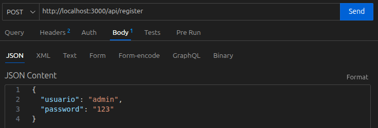
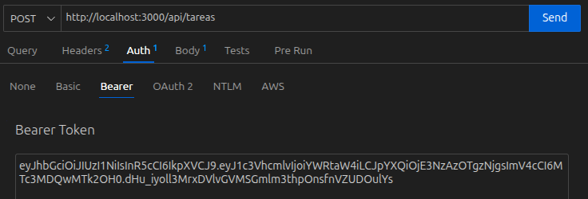
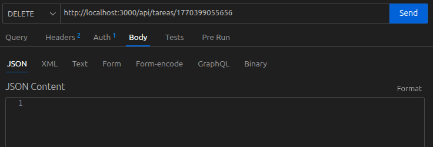

# Actividad 3

## API REST de Tareas

Esta es una API RESTful que se desarrolló con Node y Express para gestionar una lista de tareas, este sistema permite realizar operaciones CRUD completas, utiliza un sistema de autenticación basado en JWT (JSON Web Tokens) y almacena la información de forma persistente en archivos JSON. 

## Características Técnicas

* Gestión de Datos Asincrónica: Se utiliza el módulo nativo fs.promises para interactuar con archivos JSON sin bloquear el Event Loop.

* Seguridad y Autenticación: Encriptación de contraseñas con bcryptjs y protección de rutas mediante middlewares de autenticación con jsonwebtoken.

* Arquitectura Modular: Separación clara de responsabilidades en carpetas de rutas, middlewares y utilidades.

* Manejo de Errores: Middleware personalizado para capturar errores de forma centralizada y responder con códigos de estado HTTP adecuados (400, 401, 404, 500).

## Instalación 
1. Se instalaron dependencias con: 
* sudo apt install apt.
* npm init -y
* npm install express body-parser jsonwebtoken bcryptjs

## Uso

Se utulizó la herramienta de Thunder Client para poder probar la API de manera correcta, primero para probarla se abre Thunder Client y se da click en "New Request".

### Registro

Se selecciona POST y se pone la url para modificar el archivo en este caso "http://localhost3000/api/register" para registrar un nuevo usuario como se muestra en la siguiente imagen:

Se da click en el boton "Send"

### Login

Después se da click nuevamente en New Request y se selecciona POST con el siguiente link "http://localhost3000/api/login" y después se pone el usuario y constraseña registrado y se da click en Send para que te arroje el Token con el que podrás acceder a el gestor de tareas.

### Registrar Tarea

Para registrar una tarea es con el mismo link pero al final con /tareas, en body se pone el titulo y descripcion de la tarea:

Para que se pueda registrar se tiene que ir a la sección Auth y poner el token del usuario registrado:

Se da click en Post y en automático se va a registrar la tarea en el documento tareas.json 

### Modificar Tarea

Para modificar tarea se tiene que poner en modo PUT y con el mismo link solo añadiendo al final /tareas/(id_tarea_registrada) se va igual a body y se actualiza el titulo o descripción de esa tarea: 

igualmente se debe poner el token para poder modificar la tarea.

### Eliminar Tarea 

Para eliminar una tarea se debe poner el modo DELETE seguido del mismo link o¿con la id de la tarea que se quiere eliminar, para eliminarla se debe dar click en Send y se elimina la tarea seleccionada.

## COnclusión

Esta API RESTful gestiona tareas mediante Node.js y Express utilizando un enfoque asincrónico con el módulo fs para interactuar con archivos JSON sin bloquear el flujo principal de ejecución, la seguridad se basa en un sistema de autenticación por tokens JWT y encriptación de contraseñas con bcryptjs para proteger el acceso a las rutas de creación, edición y eliminación, gracias al uso de promesas y funciones async/await, el servidor mantiene un alto rendimiento al delegar las tareas de lectura y escritura al sistema operativo, permitiendo que el Event Loop atienda múltiples solicitudes simultáneamente, además, cuenta con una arquitectura modular que separa las rutas de la lógica de negocio y utiliza middlewares personalizados para validar datos y centralizar el manejo de errores con los códigos de estado HTTP correspondientes.